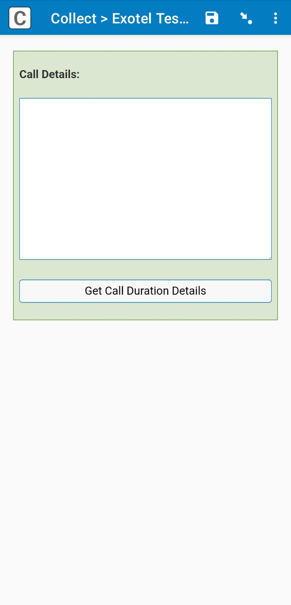
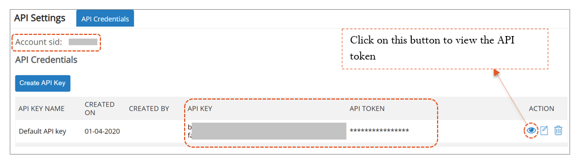

# Exotel Call Details Fetcher

> A SurveyCTO field plug-in that retrieves full call metadata from Exotel after a call is completed - including duration, status, and timestamps - and stores it as structured JSON directly in the form.

[](https://github.com/suvita-public/surveycto-exotel-call-metadata/raw/master/exotel-call-metadata.fieldplugin.zip)



---

## Description

This is a **companion field plug-in** for SurveyCTO forms that use Exotel for phone calls. It is not a dialer. It works **after** a call has already been made using an Exotel dialer plug-in (such as the [Suvita Exotel Dialer plug-in](https://github.com/suvita-public/scto-exotel)).

When the enumerator presses **"Get Call Duration Details"**, the plug-in:

1. Reads the JSON stored by the dialer plug-in in a previous field
2. Extracts all call SIDs from that response
3. Calls the Exotel API for each SID to fetch the full call record
4. Displays the result in the form and saves it as structured JSON in the current field

This lets you capture verified call duration, exact start/end timestamps, and call status - data that the dialer plug-in alone does not store.

---

## Background

Built by the Tech Team at [Suvita](https://suvita.org) for field programs where enumerators use Exotel to call beneficiaries through SurveyCTO. The standard Exotel dialer plug-in stores a call SID when a call is initiated, but does not automatically fetch post-call metadata like duration or final status. This plug-in was created to close that gap - giving program teams reliable call duration data within the form itself, without any post-processing step outside SurveyCTO.

---

## How it fits in the workflow

```
[Field 1] Exotel Dialer plug-in
    -> Enumerator starts the call
    -> Stores JSON with call SID(s) in field value

[Fields in between]
    -> Ask all survey questions that need to be completed during the phone call
    -> Enumerator finishes the conversation and the call disconnects

[Field 2] This plug-in (Exotel Call Details Fetcher)
    -> Appears a few seconds after the call drops
    -> Reads the JSON from Field 1 via sourceField parameter
    -> Enumerator clicks "Get Call Duration Details"
    -> Plug-in calls Exotel API for each call SID
    -> Stores full call metadata as JSON in this field's value
```

Both fields must be present in the same form, and all survey questions asked during the phone call should appear between them. The dialer field must come first, and this metadata field should appear only after the call has dropped and a few seconds have passed, so the metadata is available on the Exotel platform to fetch through the API.

---

## Features

- Reads call SID(s) from a previous Exotel dialer plug-in field automatically
- Supports **multiple calls in a single session** - fetches metadata for all call SIDs found in the source field (batch lookup)
- Calls Exotel's `?details=true` endpoint for complete call records including leg-level detail
- Returns structured JSON output stored directly in the SurveyCTO field - ready for publishing, exports, or downstream analysis
- Consistent error handling - API failures and missing data are returned in the same JSON structure as successful responses, so downstream parsing never breaks
- Button is disabled while the API call is in flight to prevent duplicate requests
- Works on SurveyCTO Collect (Android). **Does not work on web forms** due to browser CORS restrictions on direct Exotel API calls.

---

## Getting Started

### Prerequisites

- An active [Exotel](https://exotel.com) account with API access
- Your Exotel API key, API token, and Account SID (see [Credentials](#exotel-api-credentials) below)
- A SurveyCTO form that already uses an Exotel dialer field plug-in in an earlier field
- SurveyCTO Collect **version 2.70.2 or higher** installed on the enumerator's Android device

### Installation

1. Download `exotel-call-metadata.fieldplugin.zip` from this repository.
2. Go to your SurveyCTO server and open the form you want to add this plug-in to.
3. Upload the `.zip` file as a media attachment to the form.
4. Add a `text` field to your form where you want to capture call metadata.
5. Set the field's `appearance` to `custom-exotel-call-metadata` and supply the required parameters (see below).

### Form design

The plug-in field should appear **after** the Exotel dialer field in your form. Reference the dialer field using the `sourceField` parameter.

Example XLSForm appearance column entry:

```
custom-exotel-call-metadata(
  apikey='your-api-key',
  apitoken='your-api-token',
  accountSid='your-account-sid',
  sourceField=${exotel_dialer_field}
)
```

Replace `exotel_dialer_field` with the actual field name of your dialer field.

---

## Required Parameters

| Parameter | Description |
|---|---|
| `apikey` | Your Exotel API key. Found in the API section of your Exotel account settings. |
| `apitoken` | Your Exotel API token. Found alongside the API key. |
| `accountSid` | Your Exotel Account SID. Found in the API section of your Exotel account settings. |
| `sourceField` | The SurveyCTO field that holds the dialer plug-in's JSON output. Pass it as `${field_name}`. This field must come before this one in the form. |

All four parameters are required. The plug-in will return a JSON error if `sourceField` is missing, empty, or contains invalid JSON.

---

## Exotel API Credentials

To find your credentials, log in to your Exotel account and go to **Settings -> API**. This section is only accessible to account administrators.

You need:
- **API Key**
- **API Token**
- **Account SID**



> These credentials authenticate the API request directly from the device. Do not share them publicly. Store them securely - for example, using SurveyCTO's server-managed parameters or a preloaded dataset accessible only to authorized forms.

---

## Output Format

The plug-in stores its output as a JSON array in the SurveyCTO field. Each item in the array corresponds to one call SID fetched from the source field.

### Successful response

```json
[
    {
        "Call": {
            "Sid": "a0e2d63b6af59ba2a7b6a2d52a678965",
            "DateCreated": "2024-03-15 10:30:00",
            "DateUpdated": "2024-03-15 10:31:00",
            "AccountSid": "your-account-sid",
            "To": "0XXXXXXXXXX",
            "From": "0XXXXXXXXXX",
            "PhoneNumberSid": "PN...",
            "Status": "completed",
            "StartTime": "2024-03-15 10:30:05",
            "EndTime": "2024-03-15 10:30:50",
            "Duration": "45",
            "Direction": "outbound-api",
            "Uri": "/v1/Accounts/.../Calls/....json"
        }
    }
]
```

`Duration` is in seconds. `Status` will typically be `completed`, `busy`, `no-answer`, or `failed`.

### Error response

Errors use the same array structure so downstream parsing stays consistent:

```json
[
    {
        "Call": {
            "Sid": "a0e2d63b6af59ba2a7b6a2d52a678965",
            "Error": "Error: 404 - Not Found"
        }
    }
]
```

If the `sourceField` is empty or unparseable, the error appears without a SID:

```json
[
    {
        "Call": {
            "Sid": null,
            "Error": "No valid Call SIDs found."
        }
    }
]
```

---

## Source Field Format

The plug-in expects `sourceField` to contain JSON in the format produced by the Suvita Exotel dialer plug-in. Specifically, it looks for a `plugin_response` array where each item has a `Call.Sid`:

```json
{
    "plugin_response": [
        {
            "Call": {
                "Sid": "a0e2d63b6af59ba2a7b6a2d52a678965",
                "..."
            }
        }
    ]
}
```

If your dialer plug-in uses a different output format, you will need to adapt `script.js` accordingly (see [Contributing](#contributing)).

---

## Project Structure

```
exotel-call-metadata.fieldplugin.zip
|-- manifest.json       # Plug-in metadata: name, author, version, supported field types
|-- template.html       # UI layout: textarea for call info, button to trigger fetch
|-- script.js           # Core logic: reads sourceField, extracts SIDs, calls Exotel API, saves output
`-- style.css           # Styling for the plug-in container, button, and response textarea
```

To edit the plug-in, unzip the file, make your changes, and re-zip all four files (not the folder - the four files directly) into a new `.fieldplugin.zip`.

---

## Limitations

- **Android only.** Web forms block direct Exotel API calls due to browser CORS policy. The plug-in will not work on SurveyCTO web forms.
- **Indian phone numbers and Exotel India.** The plug-in hits `api.exotel.in`. If you use Exotel's Southeast Asia or other regional endpoints, update the URL in `script.js`.
- **Credentials in form parameters.** API credentials are passed as appearance parameters. For production use, consider SurveyCTO server-managed parameters to avoid credentials appearing in the XLSForm file itself.
- **No automatic trigger.** The enumerator must manually press the button. The plug-in does not auto-fetch on field load.
- **Requires SurveyCTO Collect 2.70.2+.** Older versions do not support custom field plug-ins.

---

## Contributing

Pull requests are welcome. To contribute:

1. Fork this repository
2. Create a branch: `git checkout -b your-feature-name`
3. Edit the source files inside the zip (unzip, edit, re-zip)
4. Test on a real SurveyCTO form on Android before submitting
5. Open a pull request with a clear description of what changed and why

For bugs or feature requests, open an issue on GitHub.

---

## More Resources

- **SurveyCTO field plug-in developer documentation**
  [https://github.com/surveycto/Field-plug-in-resources](https://github.com/surveycto/Field-plug-in-resources)

- **Using field plug-ins in SurveyCTO forms**
  [https://docs.surveycto.com/02-designing-forms/03-advanced-topics/06.using-field-plug-ins.html](https://docs.surveycto.com/02-designing-forms/03-advanced-topics/06.using-field-plug-ins.html)

- **Exotel API documentation**
  [https://developer.exotel.com/api](https://developer.exotel.com/api)

- **Suvita Exotel Dialer plug-in** (the dialer this plug-in is designed to work with)
  [https://github.com/suvita-public/scto-exotel](https://github.com/suvita-public/scto-exotel)

---

## License

MIT License. See [LICENSE](LICENSE) for details.

---

## Built by

Built by the Tech Team at [Suvita](https://suvita.org) (subscriptions@suvita.org).
Suvita is a public health organization working on maternal and child health in India.
